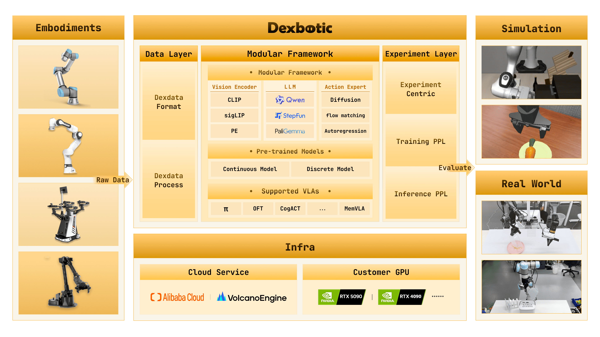

<div align="center">
  

  # One-Stop VLA Development Toolbox for Embodied Intelligence

  [](https://arxiv.org/pdf/2510.23511)
  [](https://huggingface.co/Dexmal)
  [](https://dexbotic.com/docs/)
  [](LICENSE)
  [](README.zh-CN.md)

  <p align="center">
    <strong>Pretraining · Fine-tuning · Inference · Evaluation</strong><br>
    Supporting mainstream policies such as π0, CogACT, OFT, MemVLA, and more
  </p>
</div>

## Introduction

**Dexbotic** is a VLA (Vision-Language-Action) development toolbox built on the PyTorch framework, designed to provide a unified and efficient solution for embodied intelligence research. It comes with built-in environment configurations for various mainstream VLA models, allowing users to reproduce, fine-tune, and inference cutting-edge VLA algorithms with simple setup.

- **Ready-to-Use VLA Framework**: Centered around VLA models, integrating embodied manipulation and navigation capabilities, supporting multiple cutting-edge algorithms.
- **High-Performance Pre-trained Foundation Models**: For mainstream VLA algorithms such as π0 and CogACT, Dexbotic provides multiple optimized pre-trained models.
- **Modular Development Architecture**: Adopting a "layered configuration + factory registration + entry dispatch" architecture, users can easily modify configurations, change models, or add tasks by simply modifying experimental scripts.
- **Unified Cloud and Local Training**: Fully supports both cloud and local training needs, supporting cloud training platforms such as Alibaba Cloud and Volcano Engine, while also accommodating consumer-grade GPUs for local training.
- **Extensive Robot Compatibility**: For mainstream robots such as UR5, Franka, and ALOHA, Dexbotic provides a **unified training data format** and deployment scripts.



## 🔥 News

- **[2026-01-08]** Added **Co-training** capability, enabling joint optimization of action experts and LLMs for the CogACT model. Also released a specialized image compatible with **Blackwell GPUs**.
- **[2025-12-29]** Full support for **OFT** and **Pi0.5** models.
- **[2025-10-20]** Dexbotic officially released! Check out the [technical report](https://arxiv.org/pdf/2510.23511) and [official documentation](https://dexbotic.com/docs/) for details.


## Quick Start

We strongly recommend using Docker for development or deployment to get the best experience.

### 1. Installation and Environment Setup

```bash
# 1. Clone the repository
git clone https://github.com/dexmal/dexbotic.git

# 2. Start Docker container
docker run -it --rm --gpus all --network host \
  -v $(pwd)/dexbotic:/dexbotic \
  dexmal/dexbotic \
  bash

# 3. Activate environment and install dependencies
cd /dexbotic
conda activate dexbotic
pip install -e .
```
> **System Requirements**: Ubuntu 20.04/22.04, recommended GPUs: RTX 4090, A100, or H100 (8 GPUs recommended for training, 1 GPU for deployment).

<details>
<summary>Using on Blackwell GPUs</summary>

For users with Blackwell architecture GPUs (e.g., B100, RTX 5090), please use the specialized Docker image `dexmal/dexbotic:c130t28`.

```bash
# 1. Start Docker with Blackwell image
docker run -it --rm --gpus all --network host \
  -v /path/to/dexbotic:/dexbotic \
  dexmal/dexbotic:c130t28 \
  bash

# 2. Activate environment
cd /dexbotic
pip install -e .
```

</details>

### 2. Usage Guide

- [Testing and Evaluation](docs/Tutorial.md#evaluation)
- [Training with Provided Simulation Data](docs/Tutorial.md#training-a-model-with-provided-data)
- [Training with Your Own Data](docs/Tutorial.md#training-a-model-with-your-own-data)


## Benchmark Results

The following shows a comparison of evaluation results between models trained with Dexbotic and original models on mainstream simulation environments. **View more detailed evaluation results**: [Benchmark Results](docs/ModelZoo.md#benchmark-results)

### Libero

| Model | Average | Libero-Spatial | Libero-Object | Libero-Goal | Libero-10 |
| --- | --- | --- | --- | --- | --- |
| CogACT | 93.6 | 97.2 | 98.0 | 90.2 | 88.8 |
| DB-CogACT | 94.9 | 93.8 | 97.8 | 96.2 | 91.8 |
| π0 | 94.2 | 96.8 | 98.8 | 95.8 | 85.2 |
| DB-π0 | 93.9 | 97 | 98.2 | 94 | 86.4 |
| MemVLA | 96.7 | 98.4 | 98.4 | 96.4 | 93.4 |
| DB-MemVLA | 97.0 | 97.2 | 99.2 | 98.4 | 93.2 |

### CALVIN

| Model | Average Length | 1 | 2 | 3 | 4 | 5 |
| --- | --- | --- | --- | --- | --- | --- |
| CogACT | 3.246 | 83.8 | 72.9 | 64 | 55.9 | 48 |
| DB-CogACT | 4.063 | 93.5 | 86.7 | 80.3 | 76 | 69.8 |
| OFT | 3.472 | 89.1 | 79.4 | 67.4 | 59.8 | 51.5 |
| DB-OFT | 3.540 | 92.8 | 80.7 | 69.2 | 60.2 | 51.1 |

### SimplerEnv

| Model | Average | Put Spoon on Towel | Put Carrot on Plate | Stack Green Block on Yellow Block | Put Eggplant in Yellow Basket |
| --- | --- | --- | --- | --- | --- |
| CogACT | 51.25 | 71.7 | 50.8 | 15 | 67.5 |
| DB-CogACT | 69.45 | 87.5 | 65.28 | 29.17 | 95.83 |
| OFT | 30.23 | 12.5 | 4.2 | 4.2 | 100 |
| DB-OFT | 76.39 | 91.67 | 76.39 | 43.06 | 94.44 |
| MemVLA | 71.9 | 75.0 | 75.0 | 37.5 | 100.0 |
| DB-MemVLA | 84.4 | 100.0 | 66.7 | 70.8 | 100.0 |

### ManiSkill2

| Model | Average | PickCube | StackCube | PickSingleYCB | PickSingleEGAD | PickClutterYCB |
| --- | --- | --- | --- | --- | --- | --- |
| CogACT | 40 | 55 | 70 | 30 | 25 | 20 |
| DB-CogACT | 58 | 90 | 65 | 65 | 40 | 30 |
| OFT | 21 | 40 | 45 | 5 | 5 | 0 |
| DB-OFT | 63 | 90 | 75 | 55 | 65 | 30 |
| π0 | 66 | 95 | 85 | 55 | 85 | 10 |
| DB-π0 | 65 | 95 | 85 | 65 | 50 | 30 |

### RoboTwin2.0

| Model | Average | Adjust Bottle | Grab Roller | Place Empty Cup | Place Phone Stand |
| --- | --- | --- | --- | --- | --- |
| CogACT | 43.8 | 87 | 72 | 11 | 5 |
| DB-CogACT | 58.5 | 99 | 89 | 28 | 18 |


## Support Us

We are continuously improving, with more features coming soon. If you like this project, please give us a star on GitHub [](https://github.com/dexmal/dexbotic). Your support is our motivation to keep moving forward!

If Dexbotic has been helpful in your research work, please consider citing our technical report:

```bibtex
@article{dexbotic,
  title={Dexbotic: Open-Source Vision-Language-Action Toolbox},
  author={Dexbotic Contributors},
  journal={arXiv preprint arXiv:2510.23511},
  year={2025}
}
```

## License

This project is licensed under the [MIT License](LICENSE).